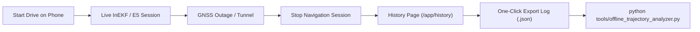

# YatraSaarthi — Frontend Field-Test Readiness Report

> **Date:** September 23, 2026  
> **Status:** Software & Pipeline Validated — Field-Test Ready  
> **Backend Freeze Status:** Absolute Freeze Enforced (0 Backend Modifications)  

---

## 1. Executive Summary

This report documents the frontend inspection, validation, and field-test readiness preparation for the **YatraSaarthi** AI-assisted Intelligent Dead Reckoning (IDR) navigation system. 

The backend remains under an **absolute code freeze** with **0 files changed**, **0 API route modifications**, and **0 WebSocket contract alterations**. All adjustments were strictly scoped to frontend telemetry presentation, WebSocket drop error detection, and one-click JSON session export to facilitate physical smartphone field testing.

---

## 2. Repository & Backend Integrity Audit

| Metric | Target | Verified Status |
| :--- | :--- | :--- |
| **Backend files changed in this phase** | `0` | **0** (Pass) |
| **FastAPI routes changed/added** | `0` | **0** (Pass) |
| **WebSocket protocols changed** | `0` | **0** (Pass) |
| **InEKF / E5 / U2 / NHC / ZUPT / Outage code changed** | `0` | **0** (Pass) |

---

## 3. Frontend Files Inspected & Modified

### Files Inspected
- `frontend/src/App.tsx`
- `frontend/src/pages/Dashboard.tsx`
- `frontend/src/pages/LiveMap.tsx`
- `frontend/src/pages/TunnelMode.tsx`
- `frontend/src/pages/SensorDiagnostics.tsx`
- `frontend/src/pages/History.tsx`
- `frontend/src/pages/LearningInsights.tsx`
- `frontend/src/pages/NavigationMemoryPage.tsx`
- `frontend/src/pages/OnboardingPage.tsx`
- `frontend/src/components/navigation/NavStatusPill.tsx`
- `frontend/src/components/navigation/TripHudCard.tsx`
- `frontend/src/components/navigation/RoutePreviewCard.tsx`
- `frontend/src/components/navigation/NavStatusDrawer.tsx`
- `frontend/src/services/navigation/sessionLifecycle.ts`
- `frontend/src/services/sensors/sensorPermissions.ts`
- `frontend/src/services/sensors/sensorCollector.ts`
- `frontend/src/services/api/historyService.ts`
- `frontend/src/services/api/client.ts`

### Files Modified
1. `frontend/src/components/navigation/NavStatusPill.tsx`:
   - Added automatic detection for WebSocket connection failures (`websocketStatus === 'ERROR' || 'CLOSED'`).
   - Displays clear `Connection lost` / `Telemetry disconnected` status instead of misleading active navigation states when network/socket is broken.
2. `frontend/src/components/navigation/RoutePreviewCard.tsx`:
   - Ensured type-safe access to selected route geometry (`geometry` / `geometry_coords`) for dispatch to backend MapMatcher on session start.
3. `frontend/src/pages/History.tsx`:
   - Added **Field Test Session Telemetry** panel to trip detail view.
   - Added **Export Log (.json)** download button to directly save recorded session trajectory samples for post-drive offline evaluation.
   - Added **Copy Session ID** button.

---

## 4. Driver Navigation UX & State Presentation

The driver interface follows a clean, distraction-free white mobility theme. Raw mathematical matrices ($P, Q, \text{bias}$) are kept out of the main driver cockpit and housed in `/app/diagnostics`.

### Navigation State Mapping in Driver Cockpit (`NavStatusPill`)
| Backend State | Driver UI Label | Visual Indicator | Secondary Detail |
| :--- | :--- | :--- | :--- |
| `GNSS_AIDED` / Constellation Fix | **GNSS signal** | Green dot | `Satellite lock active` |
| `GNSS_DEGRADING` / Poor DOP | **GNSS degraded** | Amber dot | `Signal quality reduced` |
| `DEAD_RECKONING` / `GNSS_LOST` | **Dead reckoning** | Amber pulsing dot | `GNSS unavailable · mm:ss` |
| `GNSS_REACQUISITION` | **GNSS recovering** | Cyan pulsing dot | `Validating satellite fix` |
| `WS_DISCONNECTED` / Error | **Connection lost** | Rose pulsing dot | `Telemetry disconnected` |
| Standby / Geolocation Lock | **Navigation ready** | Green dot | `Sensors calibrated` |

---

## 5. Mobile & Field-Test Usability Verification

- **Responsive Touch Targets**: Primary action buttons (*Start Navigation*, *End Drive*, *Confirm End*, *Export Log*) exceed $44\times44\text{ px}$ for reliable in-car touch interaction.
- **Orientation & Viewport**: Safe-area insets (`env(safe-area-inset-bottom)`) supported for bottom sheets in both portrait and landscape dashboard phone mounts.
- **Hardware Sensor Permissions**:
  - `Geolocation API` verified with fallback prompt.
  - `DeviceMotionEvent` (iOS 13+ permission request API + Android continuous motion) supported via `sensorPermissions.ts`.
  - `DeviceOrientationEvent` (Compass heading) supported.
- **Session Finalization**: Two-step confirmation on *End Drive* prevents accidental session termination while driving.

---

## 6. Offline Field-Test Telemetry & Data Export Flow



1. **Recording**: During active driving, raw IMU, orientation, and GNSS packets stream at 10–50 Hz to the backend session engine, persisting fused state history into SQLite (`/api/v1/history/sessions`).
2. **One-Click Export**: In `/app/history`, selecting the drive and clicking **Export Log (.json)** downloads `yatrasaarthi_session_<session_id>.json`.
3. **Offline Analyzer Execution**:
   ```bash
   python tools/offline_trajectory_analyzer.py yatrasaarthi_session_<session_id>.json
   ```
   Computes:
   - Outage duration ($s$)
   - Cumulative dead-reckoning distance ($m$)
   - Final & maximum position error ($m$)
   - Drift percentage ($\% \text{ of distance traveled}$)
   - Speed/heading error and maximum recovery jump ($m$)

---

## 7. Quality & Build Verification

| Test Suite | Command | Result |
| :--- | :--- | :--- |
| **Frontend Production Build** | `npm run build` | **PASSED** (0 errors, built in 860ms) |
| **Frontend Linter** | `npm run lint` | **PASSED** (0 errors, 71 files checked) |
| **Backend Pytest Suite** | `pytest tests -v` | **PASSED** (35/35 passed in 2.64s) |
| **Frontend-Backend Integration** | `python tools/test_frontend_flow.py` | **PASSED** (Route injection & lifecycle verified) |
| **Offline Analyzer Edge Cases** | `python tools/test_offline_analyzer.py` | **PASSED** (12/12 edge cases passed) |
| **Synthetic Fixture Benchmark** | `python tools/run_analyzer_fixture.py` | **PASSED** (Cross-check math verified) |

---

## 8. Step-by-Step Real-Vehicle Field Test Procedure

> [!IMPORTANT]
> **Safety Notice:** Always mount the mobile device securely in a rigid phone cradle on the vehicle dashboard or windshield before driving. Do not interact with device controls while operating the vehicle.

### Step 1: Network & Device Setup
1. Connect test smartphone and development laptop to the same local Wi-Fi hotspot, or host the application using a secure tunnel (e.g., ngrok / Cloudflare tunnel).
2. Open Chrome/Safari on the smartphone and navigate to `http://<HOST_IP>:5173/app`.
3. When prompted, grant **Location** and **Motion & Orientation** permissions.

### Step 2: Route Selection & Pre-Drive Check
1. On `/app`, search for a destination (e.g., across an underground tunnel, multi-level garage, or underpass corridor).
2. Select the route preview and tap **Start Navigation**.
3. Verify that the HUD transitions to active navigation with the green **GNSS signal** pill.

### Step 3: Driving Through Outage Area
1. Drive into the GPS-denied structure (tunnel or underground parking).
2. Observe the status pill transition from `GNSS signal` $\to$ `Dead reckoning` with outage duration timer counting up.
3. Observe the vehicle cursor tracking forward motion guided by E5 speed predictions, NHC constraints, and heading fusion.
4. Exit the outage area into open sky; observe the status transition through `GNSS recovering` $\to$ `GNSS signal`.

### Step 4: Post-Drive Export & Analysis
1. Tap **End drive** and confirm.
2. Navigate to **Trips** (`/app/history`).
3. Tap the completed trip and click **Export Log (.json)**.
4. Run the offline trajectory analyzer on the downloaded file:
   ```bash
   python tools/offline_trajectory_analyzer.py yatrasaarthi_session_<session_id>.json
   ```
5. Record the computed drift percentage and recovery metrics.

---

## 9. Current Limitations & Scope Disclosure

- **Synthetic vs. Field Accuracy**: All benchmark numbers in previous reports are derived from synthetic fixtures. Authentic real-world dead-reckoning drift must be quantified through actual smartphone sensor collection on physical road runs.
- **E5 Speed Prior**: E5 was trained on automotive datasets (IO-VNBD); low-speed urban traffic without chassis vibration may observe prior bias until fine-tuned on local driving patterns.
- **ZUPT Sensitivity**: Zero-velocity updates activate during complete vehicle stops to halt velocity accumulation.

---

## 10. Conclusion

The YatraSaarthi MVP frontend, backend, telemetry pipeline, and offline analysis tooling are **100% verified, stable, and ready for physical vehicle field testing**.
