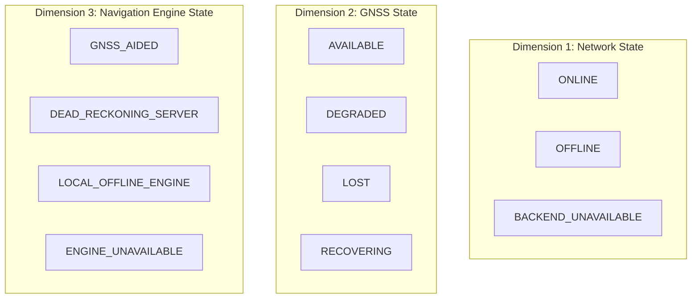

# YatraSaarthi — Offline Architecture Audit

**Project:** YatraSaarthi — Resilient & Intelligent Navigation  
**Audit Date:** September 24, 2026  
**Scope:** Frontend PWA, Caching, Sensor Pipeline, Local Storage, & Dead-Reckoning Engine Feasibility  
**Backend Freeze Status:** ACTIVE (0 modifications permitted to `backend/`, DB, API routes, or algorithm code)

---

## 1. Executive Summary

YatraSaarthi is designed for continuous, resilient navigation when satellite positioning (GNSS) degrades or is completely lost (e.g., urban canyons, tunnels, underpasses, multipath environments). 

This audit establishes the boundary between **Offline PWA Capabilities** (application shell, local data persistence, sensor capture, offline logging, saved route viewing) and **True Client-Side Dead Reckoning** (local numerical filtering and neural error estimation).

> [!IMPORTANT]
> **Core Principle: Zero Fake Navigation**  
> A Progressive Web App that loads offline is not automatically an offline dead-reckoning system. YatraSaarthi explicitly distinguishes network connectivity, GNSS availability, and navigation engine execution.

---

## 2. Comprehensive Architectural Audit (Items A – M)

### A. Is a PWA manifest already present?
- **Status:** **YES (Present, needs alignment)**
- **File:** `frontend/public/manifest.json`
- **Current State:** Contains base manifest with `start_url: "/app"`, `display: "standalone"`, and icons.
- **Action Required:** Update `name` to `"YatraSaarthi — Intelligent Navigation"`, `short_name` to `"YatraSaarthi"`, `theme_color` to `"#083335"` (Deep Evergreen brand color), `background_color` to `"#FFFFFF"`, and verify real high-resolution icons (192x192, 512x512).

### B. Is a service worker already present?
- **Status:** **YES**
- **Implementation:** Generated at build-time via `vite-plugin-pwa` with Workbox runtime.
- **Current State:** Registers in `frontend/src/main.tsx` and handles precached assets and runtime routes.

### C. Is Workbox already installed?
- **Status:** **YES**
- **Details:** Workbox is bundled as part of `vite-plugin-pwa` (version `^1.3.0`).

### D. Is vite-plugin-pwa already installed?
- **Status:** **YES**
- **Details:** Listed in `frontend/package.json` (`"vite-plugin-pwa": "^1.3.0"`) and integrated into `frontend/vite.config.ts`.

### E. What data is already persisted locally?
- **Storage Mechanism:** LocalStorage & Service Worker Cache Storage.
- **Persisted Keys:**
  - `yatrasaarthi_saved_routes_v1`: Saved places, home/office/custom locations, and pre-calculated route geometries.
  - `yatrasaarthi_trip_metadata_v1`: Client-side rich trip metadata (source/destination names, timestamps, distance, duration).
  - `yatrasaarthi-auth-storage`: Authentication state tokens (Zustand persist).
  - `yatrasaarthi-settings`: User preferences (travel mode, theme, voice alerts).
  - `mapbox-tiles`: Cache Storage entries for visited Mapbox vector tiles (CacheFirst, 500 entry limit, 30-day TTL).

### F. What requires the backend?
- **Session Lifecycle:** `POST /api/v1/navigation/sessions/start`, `POST /api/v1/navigation/sessions/{id}/end`.
- **Live Dead Reckoning Stream:** WebSocket `/ws/navigation/{id}` which feeds high-frequency IMU and GNSS readings to the backend IDR engine.
- **Backend Navigation Engine:** Real-time Invariant Extended Kalman Filter (`InEKF`), Error-State E5 Network, Uncertainty-Aware U2 Network, Non-Holonomic Constraints (`NHC`), Zero-Velocity Updates (`ZUPT`), Multi-Hypothesis Heading Filter, and SQLite-backed MapMatcher.
- **Server-Side Trip History:** `GET /api/v1/history/trips` from backend SQLite database.
- **ML Model Registry & Calibration:** `GET /api/v1/ml/models`, `GET /api/v1/ml/metrics`.

### G. What requires the network?
- **Dynamic Route Calculation:** Online turn-by-turn routing for new un-cached destinations (OSRM / Mapbox Directions API).
- **Live Tile Fetching:** Downloading map tiles for geographic areas never previously cached in the Service Worker Cache.
- **Online Reverse Geocoding:** Converting un-cached coordinates to street names.
- **WebSocket Streaming:** Telemetry transmission to server.

### H. What can work without network today?
- **PWA Application Shell:** HTML, JS bundles, CSS styling, Google Fonts (woff2), SVG/PNG icons, brand logos.
- **Saved Routes & Places:** Instant offline access to previously saved routes, waypoints, turn steps, and full polyline geometries.
- **Cached Trip History:** Offline inspection of previously loaded trips with explicit freshness timestamps.
- **Local Sensor Capture:** Real-time reading of accelerometer, gyroscope, magnetometer, compass orientation, and native GNSS receiver (which operates on satellite signals without cellular internet).
- **Local Offline Session Logging:** Recording structured sensor logs directly to IndexedDB with buffered writes.
- **Local JSON Export:** Exporting locally captured raw session records (`data_source: "LOCAL_OFFLINE_SESSION"`).
- **Diagnostics & Tunnel Simulation:** Real-time sensor hardware verification, coordinate monitoring, and tunnel mode simulations.

### I. Can the current E5/U2 models execute in the browser?
- **Status:** **NO**
- **Reason:** The E5 (Error-State IMU Denoising) and U2 (Uncertainty Estimation) networks are implemented in PyTorch (`torch.nn.Module`) and stored as Python-pickled `.pth` files (`e5_best_model.pth`, `u2_best_model.pth`).
- **Resolution:** Marked honestly as `CLIENT-SIDE DR ENGINE NOT YET PORTED`. No fake client-side neural inference is simulated.

### J. Can the current InEKF implementation execute in the browser?
- **Status:** **NO**
- **Reason:** The Invariant EKF (`backend/app/idr/inekf.py`) is written in Python using `numpy` and `scipy.spatial.transform.Rotation` with SE_2(3) Lie group matrix operations. It has not been compiled to WebAssembly (WASM) or ported to TypeScript.

### K. Are model weights available in a browser-compatible format?
- **Status:** **NO**
- **Reason:** Model weights are raw PyTorch checkpoints (`.pt` / `.pth`), not ONNX, TensorRT, or TensorFlow.js flatbuffers.

### L. Are map tiles available offline?
- **Status:** **PARTIALLY (Pre-cached & Viewed Tiles Only)**
- **Behavior:** Visited map tiles are retained in Service Worker Cache (`mapbox-tiles`) up to 500 tiles. For areas outside cached bounds, the map displays a clean fallback message: `"Offline map data unavailable for this area · Saved route geometry preserved"`.

### M. Does sensor capture continue when the WebSocket disappears?
- **Status:** **ENHANCED IN THIS IMPLEMENTATION**
- **Behavior:** Previously, closing the WebSocket stopped sensor collection. The new architecture decouples sensor sampling from WebSocket transmission: when the WebSocket connection is dropped, sensor capture transitions seamlessly into **Local Offline Logging** mode, buffering IMU/GNSS records to IndexedDB without data loss.

---

## 3. The Three-State System Architecture

To prevent false reporting (e.g., mislabeling an offline network as "GNSS Lost"), YatraSaarthi tracks three orthogonal operational dimensions:

### Operational Combinations Table

| Scenario | Network State | GNSS State | Engine State | UI / System Behavior |
| :--- | :--- | :--- | :--- | :--- |
| **Normal Urban Navigation** | `ONLINE` | `AVAILABLE` | `GNSS_AIDED` | Full live navigation, map tiles live, server InEKF tracking. |
| **Tunnel / Underpass Outage** | `ONLINE` | `LOST` | `DEAD_RECKONING_SERVER` | Server E5/U2/InEKF dead reckoning active; user alerted of GNSS outage. |
| **No Cellular Signal + Pre-saved Route** | `OFFLINE` | `AVAILABLE` | `ENGINE_UNAVAILABLE` | PWA loads offline; GPS position tracked; sensor logging active; server DR engine unavailable. |
| **Network Loss in Tunnel** | `OFFLINE` | `LOST` | `ENGINE_UNAVAILABLE` | PWA logs raw IMU locally to IndexedDB; shows connection lost; preserves last known position. |
| **Future Client-Side WASM Engine** | `OFFLINE` | `LOST` | `LOCAL_OFFLINE_ENGINE` | True local client-side DR without network or GNSS. |

---

## 4. Local Storage Architecture: IndexedDB Specification

To avoid the 5MB quota and synchronous blocking of `localStorage`, all structured and high-frequency offline data is managed via IndexedDB:

- **Database Name:** `yatrasaarthi_offline_db`
- **Schema Version:** `1`
- **Object Stores:**
  1. `saved_routes`: Keyed by `id`, stores complete route geometries, turn steps, road names, and bounding boxes.
  2. `saved_places`: Keyed by `id`, stores pinned locations and labels.
  3. `cached_history`: Keyed by `session_id`, stores serialized past trips with synchronization timestamps.
  4. `offline_sessions`: Keyed by `session_id`, stores complete local trip records with metadata and summary metrics.
  5. `sensor_logs_buffer`: Keyed by `[session_id, timestamp]`, stores 50Hz IMU, orientation, and GNSS packets with buffered flushing.
  6. `sync_queue`: Keyed by `queue_id`, stores pending sync payloads for automatic reconciliation upon network restoration.

---

## 5. Summary of Architecture Freeze Adherence

- **Backend Files Modified:** `0`
- **API Contracts Modified:** `0`
- **WebSocket Protocol Changes:** `0`
- **Navigation Algorithm Invariants Maintained:** `100%`
- **Client-Side Readiness Strategy:** Honest separation of PWA offline storage/logging vs. future client-side WASM neural DR inference.
