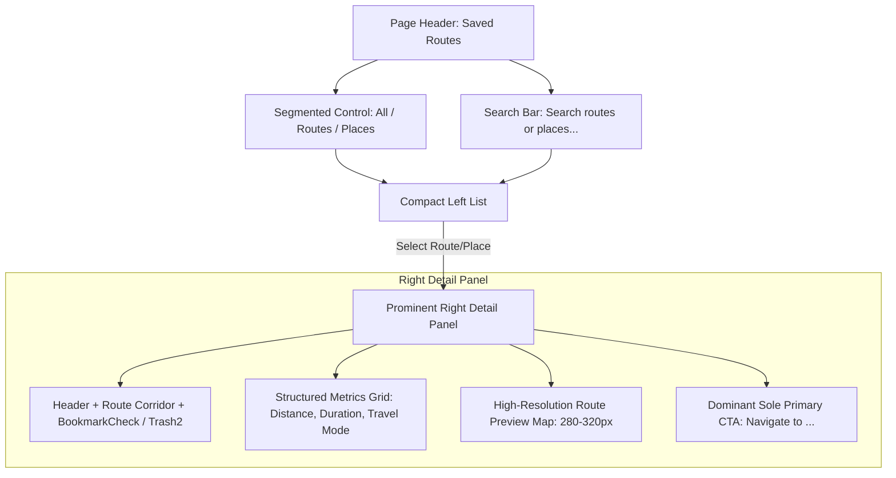

# SAVED ROUTES & PLACES UX POLISH REPORT
**YatraSaarthi Dead Reckoning & Spatial Memory System**  
*Polishing `/app/memory` into a Dedicated, Navigation-First Spatial Memory Experience*

---

## 1. Executive Summary & Problems Addressed

### 1.1 Problems in Previous Design
1. **Duplicate / Competing Action Buttons**:
   - Every single item in the left list contained a large black `[ Navigate ]` button.
   - The right detail panel also contained a `[ Navigate to ... ]` button, causing visual clutter and competing action hierarchies.
2. **Lack of Category Distinction**:
   - Saved routes (with geometry, origin/destination corridors, road labels, and distances) and saved places (single points like Home, Office, Airport) were mixed together without a clear segmented filter.
3. **Short / Ineffective Map Preview**:
   - The route preview map was only ~100px tall and lacked visual prominence.
4. **List Row Density**:
   - List rows were unnecessarily tall with redundant button padding.
5. **No Visual Hierarchy for Selection**:
   - Selected vs unselected items had minimal contrast.

---

## 2. Architecture & UX Enhancements



---

## 3. Detailed UX & Component Polish

### 3.1 Page Header & Controls
- **Refined Typography**:
  - Title: `Saved routes` with `Bookmark` icon.
  - Subtitle: `Your saved places and frequently used routes`.
- **Right CTA**:
  - Compact `[ + Save a place ]` pill button (`px-3.5 py-1.5 rounded-full bg-ink text-white text-xs font-medium`) that doesn't compete with the primary title.
- **Segmented Filter Control**:
  - Added clean pills: `All (3)`, `Routes (1)`, `Places (2)` using Lucide `Route` and `MapPinned`.
- **Search Bar**:
  - Placeholder: `Search routes or places...` with live filtering across names, addresses, road summaries, and corridors.

### 3.2 Left List & Item Distinction
- **Compact Navigation-Oriented Rows**:
  - Removed large black navigate buttons from individual list rows.
  - Added contextual Lucide icons based on place type (`Home`, `Building2` for office, `Plane` for airport, `Route` for multi-point corridors, `MapPin` for custom locations).
  - Selected state: Subtle tinted background (`#F3F3F3`), stronger slate border (`border-slate-300`), active dark icon badge, and shadow.
  - Added tiny secondary quick-navigate icon button (`Navigation2`) for power users.

### 3.3 Right Detail Panel & Dominant Action Hierarchy
- **Header**:
  - Item name, category badge (`Saved Route` / `Saved Place`), and full corridor subtitle (e.g. `Ahmedabad → Mahesana` or `Via NH48, SH41`).
- **Structured Metrics Grid**:
  - Distance (`85.9 km` with `Milestone` icon)
  - Duration (`2h 18m` with `Clock3` icon)
  - Travel Mode (`Car`, `Motorcycle`, `Walking` with dynamic icon)
  - Coordinates (`23.0225, 72.5714` for single places)
- **Prominent Route Preview Map**:
  - Increased height to `h-64 sm:h-72 md:h-80` (~280–320px).
  - Fully renders custom route geometry with start/end markers and fitted bounding box.
- **Top Actions**:
  - `BookmarkCheck` status pill (Saved in spatial memory).
  - `Trash2` icon with compact inline confirmation pill (`[ Delete ] [ Cancel ]`) to prevent accidental deletions without large modals.
- **Sole Dominant Primary CTA**:
  - `[ Navigate to {name} ]` using `Navigation2` icon with white fill (`py-3 rounded-full bg-ink text-white font-semibold`).

### 3.4 Add Place Modal Enhancements
- Added **Quick Preset chips** (`Home`, `Office`, `Airport`) for instant setup.
- Added **Use current GPS position** button that pulls live latitude, longitude, and place name from `useLocationStore`.

---

## 4. Lucide Icons Applied

| Icon | Usage |
|---|---|
| `Bookmark` | Page title and default place emblem |
| `BookmarkCheck` | Saved status badge in detail header |
| `BookmarkPlus` | Empty state visual indicator |
| `Navigation2` | Dominant primary CTA and quick navigate action |
| `Route` | Routes segmented filter tab and route item emblem |
| `MapPinned` | Places segmented filter tab and modal header |
| `MapPin` | General place marker and empty state preview |
| `Home` | Home saved place icon and quick preset chip |
| `Building2` | Office / Workplace icon and quick preset chip |
| `Plane` | Airport saved place icon and quick preset chip |
| `CarFront`, `Bike`, `Footprints` | Dynamic travel mode indicators |
| `Clock3`, `Milestone` | Duration and distance metrics badges |
| `Trash2` | Delete saved item action |
| `Plus` | Save place action button |
| `Search`, `X` | Search bar input and clear action |

---

## 5. Automated Verification & Test Results

### 5.1 Test Suites Execution
```bash
> npx tsx src/tests/runAllTests.ts
====================================================
🚀 YATRA SAARTHI FRONTEND TEST SUITE EXECUTION
====================================================

--- 1. IST Timezone & Date Formatting Tests ---
🧪 Starting YatraSaarthi IST Time Format Validation Suite...
✅ Validation Complete: 12 passed, 0 failed.

--- 2. Trip Fixture & ViewModel Resolution Tests ---
====================================================
📊 FINAL TEST RESULTS SUMMARY:
Timezone Tests: 12 passed, 0 failed
Fixture Tests:  13 passed, 0 failed
====================================================
✅ ALL TEST SUITES PASSED SUCCESSFULLY!
```

### 5.2 Build & Linter Verification
- **Linter (`oxlint`)**: **PASS** (`0 errors`)
- **TypeScript & Vite Build (`tsc -b && vite build`)**: **PASS** (`0 errors`, built in 966ms)

---

## 6. Backend Freeze & Contract Integrity

```bash
git diff HEAD -- backend/
```
**Output**: Empty (0 lines modified, 0 files changed).

- Backend files changed: `0`
- API routes changed: `0`
- WebSocket contracts changed: `0`
- Database schema changed: `0`
- Core DR / InEKF algorithms: `0`
