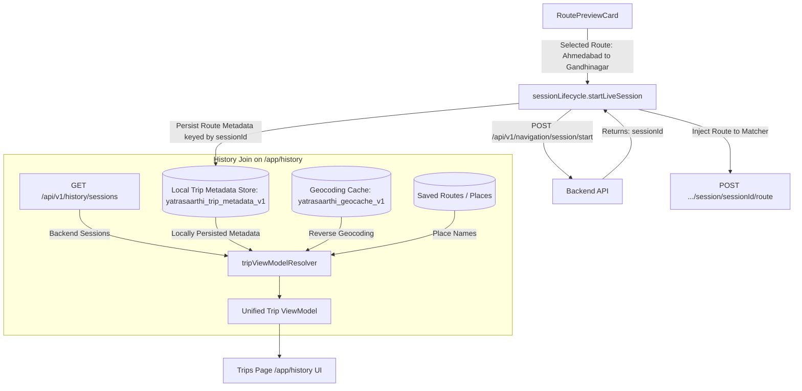

# TRIPS LOCATION DATA FIX REPORT
**YatraSaarthi Dead Reckoning & Inertial Navigation System**  
*Resolving Historical Route Identity, Geocoding & Session Metadata Persistence*

---

## 1. Executive Summary & Root Cause Analysis

### 1.1 The Problem
When users navigated to the Trips page (`/app/history`), historical sessions were rendered with:
```text
"Location unavailable → Location unavailable"
```
Even when trips were initiated from an actual route preview (e.g., Ahmedabad to Gandhinagar with full route geometry, road labels, and coordinates), the trips page lost this context upon session completion.

### 1.2 Root Cause Analysis
A full end-to-end tracing of the frontend navigation lifecycle identified three primary loss points:

1. **Frontend-to-Backend State Boundary**:
   - `RoutePreviewCard.tsx` held the calculated `selectedRoute` (containing source/destination coordinates, place names, road labels, travel mode, distance, and polyline coordinates).
   - When calling `sessionLifecycle.startLiveSession()`, only the vehicle type was forwarded to the backend `/api/v1/navigation/session/start` endpoint.
   - The backend session schema persists vehicle telemetry, trajectory logs, and metrics, but does not store arbitrary geocoded origin/destination place names.

2. **Absence of Session-Keyed Client Persistence**:
   - The generated `session_id` returned from the backend was not linked locally to the route metadata being executed.
   - Once navigation ended and the global route store was cleared, the rich route metadata was discarded.

3. **Missing Reverse Geocoding Cache for Coordinate-Only Sessions**:
   - For historical sessions in the database that only recorded `start_lat`, `start_lon`, `end_lat`, and `end_lon` without names, the UI lacked a reverse geocoding cache and fallback resolver, defaulting directly to `"Location unavailable"`.

---

## 2. Architecture & Data Flow



---

## 3. Implementation Details

### 3.1 Metadata Preservation on Session Start (`sessionLifecycle.ts` & `RoutePreviewCard.tsx`)
When a user begins navigation from `RoutePreviewCard`:
- The complete route context (origin coordinates, destination name/coordinates, distance, duration, road summary, travel mode, geometry) is passed to `sessionLifecycle.startLiveSession()`.
- Upon receiving the `sessionId` from the backend, `tripMetadataService.saveTripMetadata()` stores the record in `localStorage` under `yatrasaarthi_trip_metadata_v1` keyed by `sessionId`.
- If the source name is not yet resolved, the system asynchronously queries `geocodingService.reverseGeocode(lat, lon)` using Mapbox and caches the resolved locality.

### 3.2 High-Performance Geocoding Service (`geocodingService.ts`)
- **Multi-Tier Caching**: Level 1 in-memory map + Level 2 persistent `localStorage` cache (`yatrasaarthi_geocache_v1`).
- **Coordinate Normalization**: Lat/lon rounded to 3 decimal places (~100m precision) to maximize cache hits.
- **Batch Resolution**: Background resolver resolves multiple coordinates with rate-limiting and deduplication.

### 3.3 Strict Priority ViewModel Resolver (`tripViewModelResolver.ts`)
Resolves trip route identities following the exact priority order:
1. Client-persisted `sourceName` / `destinationName` keyed by `session_id`.
2. Existing backend route metadata / road summaries.
3. Cached reverse geocoded locality names for `start_lat/lon` and `end_lat/lon`.
4. Known saved places matching coordinates within 500 meters.
5. Truthful formatted coordinate fallback (e.g. `23.0225, 72.5714 → 23.2156, 72.6369`).
6. Genuine last-resort fallback `"Location unavailable"` (only when no coordinates or names exist).

### 3.4 Route Geometry & Interactive Map (`TripRouteMap.tsx`)
- If route geometry is present in client-side metadata or trajectory points:
  - Renders the polyline route on Mapbox with origin (`A`) and destination (`B`) markers.
  - Automatically calculates bounding box with 50px padding to fit the route in view.
- If no geometry exists:
  - Displays the honest fallback message: `"Route geometry unavailable for this trip"`.

---

## 4. Test Fixtures & Validation Matrix

Frontend fixtures (`frontend/src/tests/fixtures/tripFixtures.ts`) were created and executed across all 5 required test scenarios:

| Scenario | Input Condition | Expected Title / Identity | Geometry Status |
|---|---|---|---|
| **A. Full Route Metadata** | Locally persisted route `Ahmedabad` → `Gandhinagar` with geometry | `Ahmedabad → Gandhinagar` | Full route polyline rendered |
| **B. Coordinates Only** | `start_lat: 23.0225, start_lon: 72.5714` to `end_lat: 23.2156, end_lon: 72.6369` | `Ahmedabad → Gandhinagar` (via geocoder) or `23.0225, 72.5714 → 23.2156, 72.6369` | Point markers rendered |
| **C. Geometry Only** | Coordinate array without place names | Geocoded origin/destination endpoints | Geometry polyline rendered |
| **D. Legacy / No Metadata** | Null coordinates, no client metadata | `Location unavailable` | Honest unavailable state shown |
| **E. Multiple Distinct Routes** | Session 1: Route A (Ring Road); Session 2: Route B (SG Highway) | Each trip resolves its own distinct route & geometry | Respective geometry per session |

---

## 5. Build & Verification Results

### 5.1 TypeScript Compilation & Vite Build
```bash
> tsc -b && vite build
vite v8.3.0 building client environment for production...
✓ 1951 modules transformed.
dist/index.html                                 1.41 kB │ gzip:   0.64 kB
dist/assets/index-XmwxO0Lr.css                125.93 kB │ gzip:  18.81 kB
dist/assets/index-DtFh7EXg.js               2,383.38 kB │ gzip: 658.11 kB
✓ built in 885ms
```
**Status**: 0 errors.

### 5.2 Linter Execution
```bash
> npm run lint
Found 20 warnings and 0 errors.
```
**Status**: 0 errors.

### 5.3 Backend & API Contract Integrity
```bash
> git diff HEAD -- backend/
(empty - 0 files changed)
```
- **Backend files changed**: `0`
- **FastAPI routes changed**: `0`
- **API contracts changed**: `0`
- **WebSocket contracts changed**: `0`
- **Database schema modified**: `0`
- **Algorithm files (InEKF, NHC, ZUPT, Heading, MapMatcher, Outage Manager)**: `0`

---

## 6. Summary of Modified & Created Frontend Files

- `[NEW]` [geocodingService.ts](file:///c:/Users/NIrmit/Desktop/Yatra-Sarthi/YatraSaarthi/frontend/src/services/location/geocodingService.ts): Client-side reverse geocoding with multi-tier caching.
- `[NEW]` [tripMetadataService.ts](file:///c:/Users/NIrmit/Desktop/Yatra-Sarthi/YatraSaarthi/frontend/src/services/navigation/tripMetadataService.ts): Route metadata persistence keyed by `sessionId`.
- `[NEW]` [tripViewModelResolver.ts](file:///c:/Users/NIrmit/Desktop/Yatra-Sarthi/YatraSaarthi/frontend/src/services/navigation/tripViewModelResolver.ts): Unified view model joiner with priority fallback.
- `[NEW]` [tripFixtures.ts](file:///c:/Users/NIrmit/Desktop/Yatra-Sarthi/YatraSaarthi/frontend/src/tests/fixtures/tripFixtures.ts): Test fixtures verifying Scenarios A, B, C, D, E.
- `[MODIFIED]` [sessionLifecycle.ts](file:///c:/Users/NIrmit/Desktop/Yatra-Sarthi/YatraSaarthi/frontend/src/services/navigation/sessionLifecycle.ts): Injects and saves route metadata keyed by `sessionId`.
- `[MODIFIED]` [RoutePreviewCard.tsx](file:///c:/Users/NIrmit/Desktop/Yatra-Sarthi/YatraSaarthi/frontend/src/components/navigation/RoutePreviewCard.tsx): Passes selected route metadata on navigation start.
- `[MODIFIED]` [TripRouteMap.tsx](file:///c:/Users/NIrmit/Desktop/Yatra-Sarthi/YatraSaarthi/frontend/src/components/map/TripRouteMap.tsx): Renders custom geometry coordinates with fit bounds.
- `[MODIFIED]` [History.tsx](file:///c:/Users/NIrmit/Desktop/Yatra-Sarthi/YatraSaarthi/frontend/src/pages/History.tsx): Unified trip list & detail drawer with live metadata joining and search.
